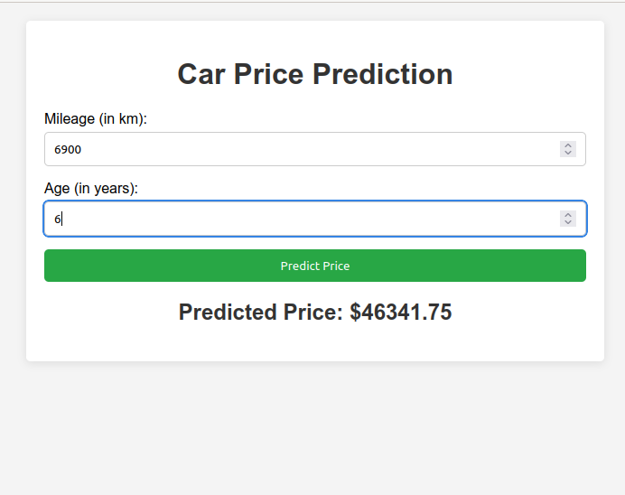

# ML_LinearRegression Project

Welcome to the ML_LinearRegression repository! This project demonstrates the use of a linear regression model to predict car prices based on mileage and age. You'll find Jupyter notebooks, datasets, and scripts showcasing various techniques used in machine learning.
## Screenshot of the Application


## Contents

- Machine Learning algorithms implementations
- Visualizations and results from various experiments

## Getting Started

Follow these instructions to set up the project on your local machine for development and testing purposes.

### Prerequisites

Make sure you have Python and pip installed. You can download Python from [python.org](https://www.python.org/downloads/).

### Installation

1. **Clone the repository:**   
``` bash
     git clone https://github.com/youssefellouh/ML_LinearRegression.git  

```

2. **Navigate to the project directory:**

```bash
        cd ML_LinearRegression
```

3. **Create a virtual environment:**

```bash
     python -m venv myenv
```


### Build and Run the Application with Docker Compose
```bash
docker compose up
```
## Usage

    Open your browser and go to http://localhost:5000.
### Project Structure
```bash 
├── app.py
├── data
│   ├── carprices.csv
│   └── image.png
├── docker-compose.yaml
├── Dockerfile
├── image.png
├── model.joblib
├── model.pkl
├── model.py
├── README.md
├── requirements.txt
├── static
│   └── css
│       └── styles.css
├── templates
│   └── index.html
└── train_test_split.ipynb
```